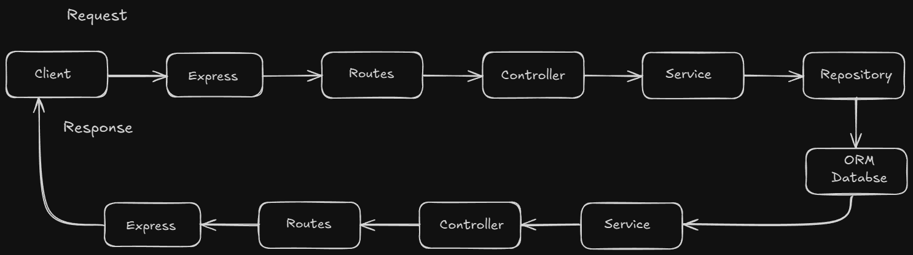
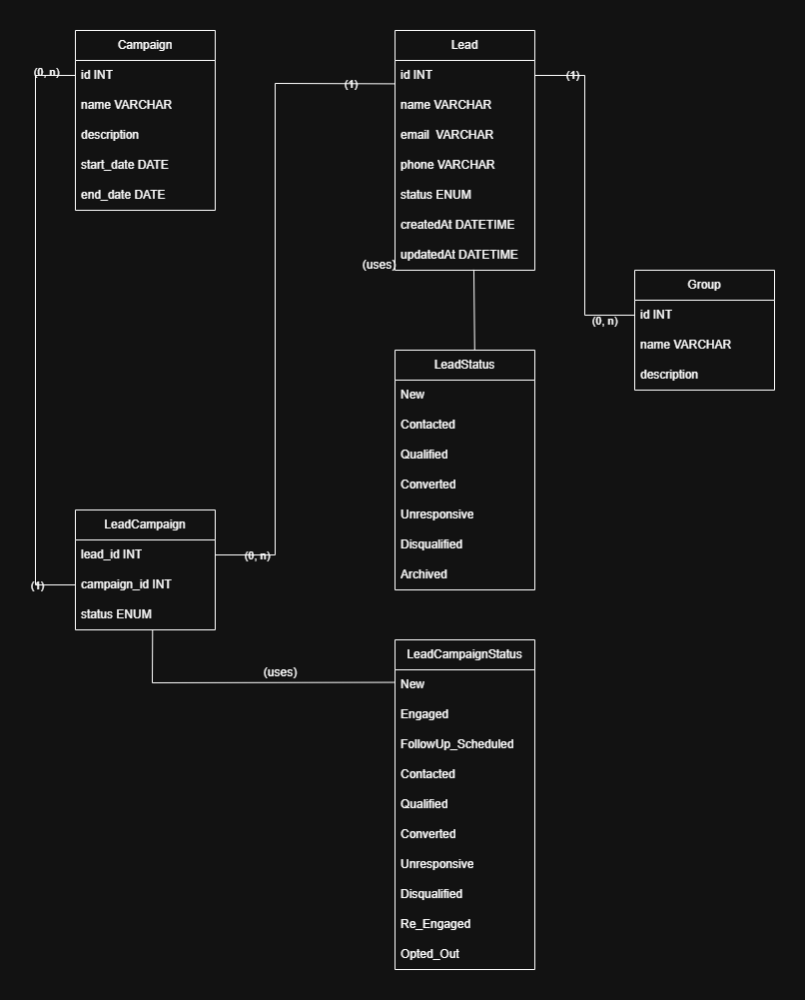

# Leads and Campaigns Management System

A backend system for managing leads, groups, and campaigns using Node.js, Express, TypeScript, and Prisma ORM.

## 🌐 Live Demo

The API is deployed and available for testing:

- **API URL**: [https://marketing-leads-api.onrender.com](https://marketing-leads-api.onrender.com)
- **API Documentation**: [https://marketing-leads-api.onrender.com/api-docs](https://marketing-leads-api.onrender.com/api-docs)

## 🚀 Features

- Complete lead management (CRUD)
- Organization of leads into groups
- Marketing campaign management
- Tracking lead status in campaigns
- RESTful API with comprehensive documentation
- Clean architecture with separation of concerns

## 🛠️ Technologies

- **TypeScript**: Static typing for improved safety and productivity
- **Node.js & Express**: Fast and scalable backend
- **Prisma ORM**: Modern ORM for database interaction
- **PostgreSQL**: Relational database system
- **Zod**: Data validation and type safety
- **Architecture Patterns**: Repositories, Services, and Controllers
- **API Documentation**: Swagger/OpenAPI
- **SOLID Principles**: Clean, maintainable code design

## 📋 Prerequisites

- Node.js v16+
- PostgreSQL or Docker

## 🔧 Installation

1. Clone the repository:
   ```bash
   git clone https://github.com/iurylenonalves/marketing-leads-api.git
   cd marketing-leads-api
   ```

2. Install dependencies:
   ```bash
   npm install
   ```

3. Configure environment variables:
   ```bash
   cp .env.example .env
   # Edite o arquivo .env com suas configurações
   ```

4. Run database migrations:
   ```bash
   npx prisma migrate dev
   ```

5. Start the server:
   ```bash
   npm run dev
   ```
## 🚢 Deployment
This project is deployed on Render. To deploy your own instance:

Deploying on Render
1. Fork or clone this repository
2. Create a Render account at [render.com](https://render.com/)
3. Create a PostgreSQL database in Render:
    - Go to Dashboard → New → PostgreSQL
    - Choose a name for your database
    - Note the connection string provided
4. Create a Web Service:

    - Dashboard → New → Web Service
    - Connect your GitHub repository
    - Configure:
        - Name: marketing-leads-api (or your preferred name)
        - Environment: Node
        - Build Command: npm install
        - Start Command: npm start
    - Add Environment Variable:
        - Key: DATABASE_URL
        - Value: Your PostgreSQL connection string from step 3
5. Deploy:
    - Click "Create Web Service"
    - Render will automatically deploy your application

The deployment process will:

- Install all dependencies
- Generate Prisma client
- Apply database migrations
- Seed the database with initial data
- Start the server

## 📚 Project Structure
   ```bass
    src/
├── controllers/     # Request handlers
├── services/        # Business logic
├── repositories/    # Data access abstraction
├── routes/          # API routes definition
│   ├── index.ts     # Routes aggregator
│   ├── leads.routes.ts
│   ├── groups.routes.ts
│   ├── campaigns.routes.ts
│   ├── groupLeads.routes.ts
│   └── campaignLeads.routes.ts
├── middlewares/     # Express middlewares
├── errors/          # Error classes and handlers
└── server.ts        # Application entry point
   ```

## 🏗️ Architecture & Database

### System Architecture


This architecture follows a layered approach with:
- **Controllers**: Handle HTTP requests and responses
- **Services**: Implement business logic
- **Repositories**: Abstract data access operations
- **Database**: PostgreSQL with Prisma ORM

### Database Schema


The database schema shows the relationships between:
- **Leads**: Core entity representing potential customers
- **Groups**: Collections of leads for organization
- **Campaigns**: Marketing initiatives targeting leads
- **Relationships**: Many-to-many connections between entities

## 📖 API Documentation
The API is documented using Swagger/OpenAPI. When the server is running, you can access the interactive documentation at:
```
http://localhost:3000/api-docs
```

### Interactive Demo


*Quick walkthrough of creating a lead and adding it to a group*

### Documentation Screenshots


*Overview of all API endpoints in Swagger UI*

### Available Endpoints

#### Leads

- GET /api/leads - List all leads
- POST /api/leads - Create a new lead
- GET /api/leads/:id - Get a specific lead
- PUT /api/leads/:id - Update a lead
- DELETE /api/leads/:id - Delete a lead

#### Groups

- GET /api/groups - List all groups
- POST /api/groups - Create a new group
- GET /api/groups/:id - Get a specific group
- PUT /api/groups/:id - Update a group
- DELETE /api/groups/:id - Delete a group

#### Leads in Groups

- GET /api/groups/:groupId/leads - List leads in a group
- POST /api/groups/:groupId/leads - Add a lead to a group
- DELETE /api/groups/:groupId/leads/:leadId - Remove a lead from a group

#### Campaigns

- GET /api/campaigns - List all campaigns
- POST /api/campaigns - Create a new campaign
- GET /api/campaigns/:id - Get a specific campaign
- PUT /api/campaigns/:id - Update a campaign
- DELETE /api/campaigns/:id - Delete a campaign

#### Leads in Campaigns

- GET /api/campaigns/:campaignId/leads - List leads in a campaign
- POST /api/campaigns/:campaignId/leads - Add a lead to a campaign
- PUT /api/campaigns/:campaignId/leads/:leadId - Update lead status in a campaign
- DELETE /api/campaigns/:campaignId/leads/:leadId - Remove a lead from a campaign

## 🔒 Clean Architecture
This project follows clean architecture principles:

1. Separation of Concerns: Each layer has a specific responsibility
2. Dependency Inversion: High-level modules don't depend on low-level modules
3. Repository Pattern: Data access is abstracted behind interfaces
4. Service Layer: Business logic is isolated from controllers
5. Input Validation: Request data is validated before processing

## 🧪 Tests
Coming soon. The project will include unit tests for services, integration tests for repositories, and E2E tests for API endpoints.

## 🤝 Contributing
Contributions are welcome! Please follow these steps:

1. Fork the project
2. Create your feature branch (git checkout -b feature/amazing-feature)
3. Commit your changes (git commit -m 'Add amazing feature')
4. Push to the branch (git push origin feature/amazing-feature)
5. Open a Pull Request

## 📄 Licença
This project is licensed under the MIT License - see the LICENSE.md file for details.

## 👨‍💻 Author
[Iury Lenon](https://github.com/iurylenonalves)

Feel free to reach out if you have questions or suggestions!

